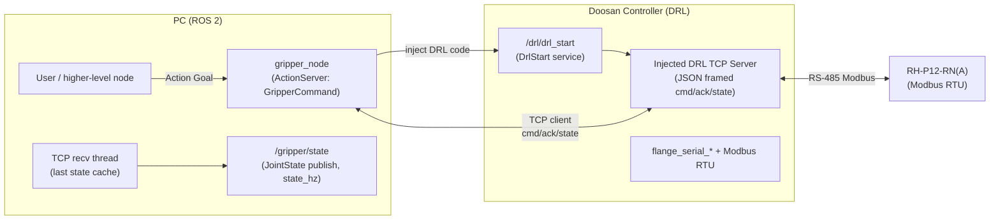
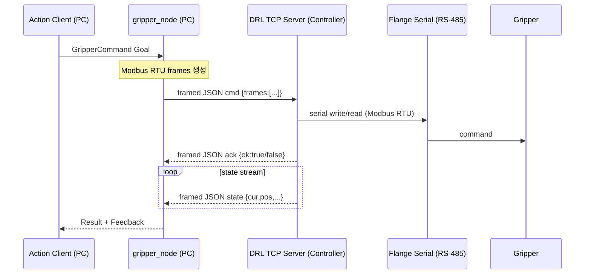
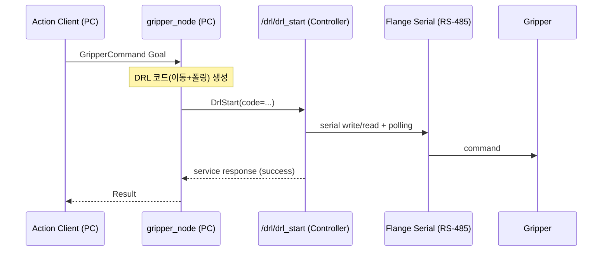

# gripper_move (`rh_p12_rna_controller`)

이 저장소는 Doosan E0509 + ROBOTIS RH‑P12‑RN(A) 그리퍼를 **ROS 2 Action**으로 제어하기 위한 패키지 `rh_p12_rna_controller`를 제공합니다.

- **패키지명**: `rh_p12_rna_controller`
- **Action 타입**: `rh_p12_rna_controller/action/GripperCommand.action`
- **노드 실행**: `ros2 run rh_p12_rna_controller gripper_node`
- **상태 토픽**: `/gripper/state` (`sensor_msgs/JointState`)

---

## 폴더 구조 (패키지 루트)

```text
gripper_move/
  CMakeLists.txt
  package.xml
  action/
    GripperCommand.action
  rh_p12_rna_controller/
    __init__.py
    gripper_node.py
    fake_drl_tcp_server.py
```

---

## 통신/제어 구조 (도식화)

### 1) TCP 모드 데이터 흐름 (추천: 실시간 피드백)



### 2) TCP 모드 시퀀스 (cmd/ack/state)



### 3) DRL 단발 실행 모드 (command_transport:=drl)



---

## 빌드

이 repo는 ROS 2 워크스페이스의 `src/` 아래에 두고 빌드합니다.

```bash
cd ~/your_ws
mkdir -p src
cd src
git clone https://github.com/jasper104615-collab/gripper_move.git
cd ..
colcon build --packages-select rh_p12_rna_controller
source install/setup.bash
```

---

## 실행 (터미널 1~4)

> 아래 예시는 컨트롤러 IP가 `110.120.1.40`인 경우입니다. 환경에 맞게 바꾸세요.

### 터미널 1) Doosan bringup

```bash
source /opt/ros/$ROS_DISTRO/setup.bash
source ~/ros2_ws/install/setup.bash

ros2 launch dsr_bringup2 dsr_bringup2_rviz.launch.py mode:=real model:=e0509 host:=110.120.1.40
```

### 터미널 2) `gripper_node` 실행 (TCP + 20Hz + direct topic 옵션)

```bash
source /opt/ros/$ROS_DISTRO/setup.bash
cd ~/your_ws
source install/setup.bash

ros2 run rh_p12_rna_controller gripper_node --ros-args \
  -p robot_ns:=dsr01 \
  -p command_transport:=tcp \
  -p tcp_external_server:=false \
  -p robot_ip:=110.120.1.40 \
  -p robot_port:=9105 \
  -p state_hz:=20.0 \
  -p tcp_ack_timeout_sec:=6.0 \
  -p direct_cmd_topic_enabled:=true \
  -p direct_cmd_topic:=/gripper/cmd_direct
```

### 터미널 3) Action goal 보내기

```bash
source /opt/ros/$ROS_DISTRO/setup.bash
cd ~/your_ws
source install/setup.bash

ros2 action send_goal /rh_p12_rna_controller/gripper_command rh_p12_rna_controller/action/GripperCommand "{action: open}"
```

```bash
source /opt/ros/$ROS_DISTRO/setup.bash
cd ~/your_ws
source install/setup.bash

ros2 action send_goal /rh_p12_rna_controller/gripper_command rh_p12_rna_controller/action/GripperCommand "{action: grab_cube}"
```

### 터미널 4) 상태 확인 + direct topic(즉시 명령)

상태:

```bash
source /opt/ros/$ROS_DISTRO/setup.bash
cd ~/your_ws
source install/setup.bash

ros2 topic echo /gripper/state
```

direct topic (Action 우회, 빠른 테스트):

```bash
source /opt/ros/$ROS_DISTRO/setup.bash
cd ~/your_ws
source install/setup.bash

ros2 topic pub --once /gripper/cmd_direct std_msgs/msg/String "{data: 'open'}"
```

```bash
ros2 topic pub --once /gripper/cmd_direct std_msgs/msg/String "{data: 'grab_cube'}"
```

```bash
ros2 topic pub --once /gripper/cmd_direct std_msgs/msg/String "{data: 'custom 420 300'}"
```

---

## 주요 파라미터 (자주 바꾸는 것만)

- **`command_transport`**: `tcp` | `drl`
- **`robot_ns`**: 예) `dsr01`
- **`robot_ip` / `robot_port`**: 컨트롤러 TCP 접속 정보
- **`state_hz`**: `/gripper/state` publish rate
- **레지스터 기본 맵(RH‑P12‑RN(A), bridge_compare 기준)**:
  - `goal_current_reg=275`
  - `goal_position_reg=282`, `goal_position_regs=2`
  - `present_current_reg=287`
  - `present_position_reg=290`, `present_position_regs=2`
  - `position_scale=1.0` (펌웨어가 pulse*64로 나오면 `position_scale:=64.0`)

---

## 로봇 없이 TCP 프로토콜 테스트 (옵션)

터미널 1:

```bash
python3 -m rh_p12_rna_controller.fake_drl_tcp_server
```

터미널 2:

```bash
ros2 run rh_p12_rna_controller gripper_node --ros-args \
  -p command_transport:=tcp \
  -p tcp_external_server:=true \
  -p robot_ip:=127.0.0.1 \
  -p robot_port:=9000
```

