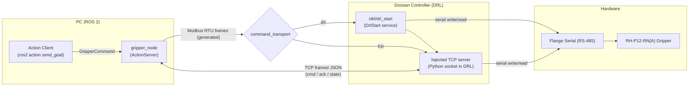
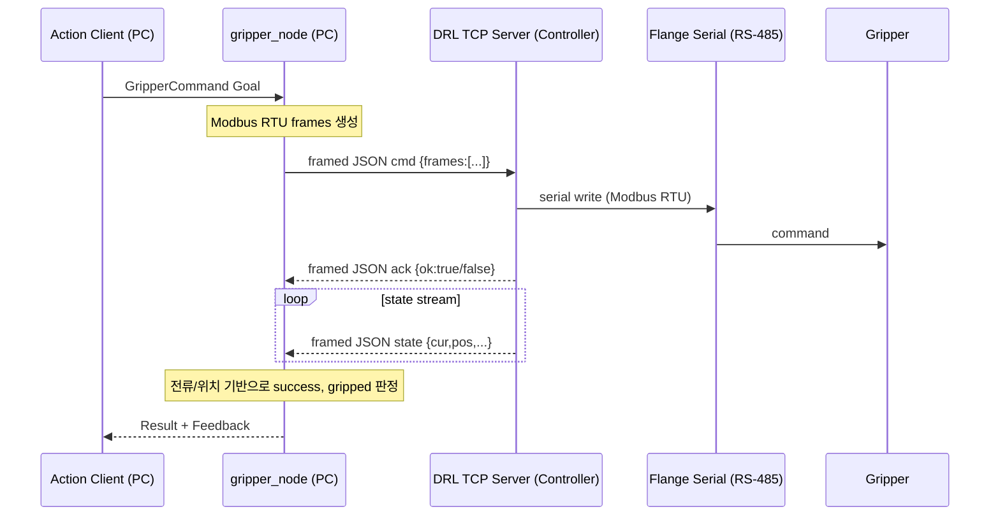
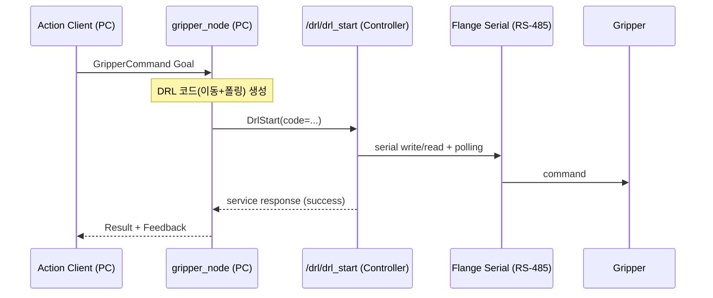
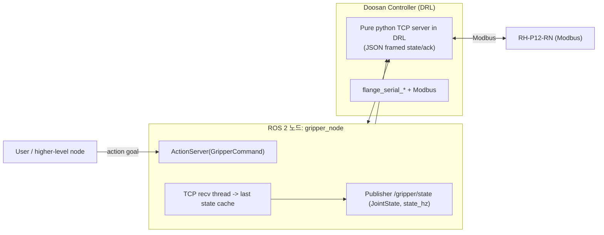

# rh_p12_rna_controller (README2)

`rh_p12_rna_controller`는 **ROS 2 Action**으로 RH-P12-RN(A) 그리퍼를 제어하는 패키지입니다.

- **Action**: `rh_p12_rna_controller/action/GripperCommand.action`
- **Node 실행 파일**: `ros2 run rh_p12_rna_controller gripper_node`
- **로봇 없이 테스트용 TCP 서버**: `fake_drl_tcp_server.py`

---

## 구성 요소

- **PC (ROS 2)**
  - Action Client: `ros2 action send_goal ...`
  - Action Server(Node): `gripper_node` (`GripperCommand` 수신/실행)
- **Doosan Controller (DRL)**
  - `drl_start`로 DRL 코드 실행/주입
  - (TCP 모드) DRL 내부에서 **Pure Python socket**으로 TCP 서버 구동
- **Hardware**
  - Flange Serial(RS-485)로 Modbus RTU 프레임 송수신
  - RH-P12-RN(A) gripper

---

## 통신/제어 구조 (도식화)

### 1) 전체 아키텍처 (모드 선택 포함)

> Mermaid 오류 방지를 위해 라벨에서 HTML(`<br/>`)을 쓰지 않고 `\n` 줄바꿈을 사용합니다.



### 2) TCP 모드 시퀀스 (PC ↔ TCP ↔ DRL ↔ Gripper)



### 3) DRL 단발 실행 모드 시퀀스 (drl_start로 move+poll)



### 4) TCP 통신 데이터 흐름 (ROS 노드/DRL/TCP/Gripper)



---

## 실행 명령어 정리

### 빌드

```bash
colcon build --symlink-install
source install/setup.bash
```

### 로봇 없이 TCP 테스트 (fake 서버)

터미널 1:

```bash
python3 src/rh_p12_rna_controller/rh_p12_rna_controller/fake_drl_tcp_server.py
```

터미널 2:

```bash
ros2 run rh_p12_rna_controller gripper_node --ros-args \
  -p command_transport:=tcp \
  -p tcp_external_server:=true \
  -p robot_ip:=127.0.0.1 \
  -p robot_port:=9000
```

Action 전송:

```bash
ros2 action send_goal /rh_p12_rna_controller/gripper_command rh_p12_rna_controller/action/GripperCommand \
  "{action: grab_cube, pulse: 0, current: 0}"
```

### 실제 로봇 (TCP 모드: DRL TCP 서버 주입)

```bash
ros2 run rh_p12_rna_controller gripper_node --ros-args \
  -p command_transport:=tcp \
  -p tcp_external_server:=false \
  -p robot_ns:=dsr01 \
  -p robot_ip:=110.120.1.40 \
  -p robot_port:=9000
```

### 실제 로봇 (DRL 단발 실행 모드: command_transport=drl)

```bash
ros2 run rh_p12_rna_controller gripper_node --ros-args \
  -p command_transport:=drl \
  -p robot_ns:=dsr01 \
  -p robot_ip:=110.120.1.40
```

